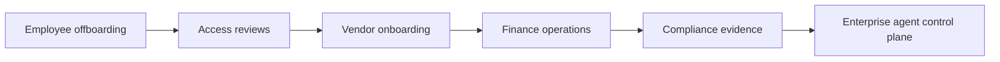

# PRD: AA Firewall

## Product Thesis

Large companies run critical operations through brittle dashboards, scripts, shared spreadsheets, and legacy terminals. The problem is not that operators lack intent; it is that intent has to be translated by hand across private systems, tribal knowledge, approvals, and compliance evidence. When the key operator leaves or the workflow spans too many systems, the process breaks.

AA Firewall is a secure behind-the-firewall agent framework that turns natural-language operations requests into typed, policy-gated, auditable internal actions. The prototype wedge is employee offboarding because it is frequent, access-sensitive, compliance-relevant, and naturally multi-system: identity, access grants, customer tickets, directory ownership, legacy billing, approval, and evidence.

## Target User and Buyer

Primary users are IT Operations, SecOps, and internal platform teams that clean up access, transfer ownership, and maintain internal systems. Their pain is repetitive operational work that is too sensitive to fully automate with a normal script and too cross-system to keep reliable as a human checklist.

Economic buyers are CIOs, CISOs, and VPs of Internal Tools at enterprises with fragmented internal systems, audit pressure, and high cost of operational mistakes. They buy because the product reduces manual toil while preserving the controls they need: RBAC, scoped authority, approval, idempotency, and audit replay.

The beachhead buyer pain is urgent because offboarding failures are both operational and regulatory: an employee can retain access, customer escalations can lose an owner, and compliance teams may not have evidence that cleanup actually happened.

## Prototype Workflow

The demo starts with one natural-language request:

> Offboard Alex Chen effective today: find systems Alex has access to, check open customer escalations, transfer ownership to Priya Shah, revoke SaaS and database access, disable legacy billing access, and produce an audit report.

AA Firewall converts that request into a typed plan. Read steps execute after policy evaluation. Destructive write steps wait behind one batch approval gate. After approval, the broker mints short-lived capabilities and executes connector actions against protocol-faithful local enterprise stand-ins:

- Internal DB: employee row and access grants.
- REST Ticketing: open tickets and ownership transfer.
- GraphQL Directory: manager relationship lookup.
- Legacy Billing: fixed-width billing record disable.

The `Live Systems` panel is the core product proof: before approval, the systems show Alex's real seeded backend state; after approval, the same systems visibly mutate. The `Security Probe` proves endpoint gating with missing-token `401`, wrong-scope `403`, and valid-write-token `200`. The evidence packet exports approvals, capabilities, tool calls, audit replay, and redacted before/after state diffs.

The prototype is intentionally more than a chat wrapper. Reviewers can inspect source code and tests for signed sessions, scoped capabilities, internal protocol routes, transactional connector writes, and chain-hashed audit export.

## Wedge to Platform

The wedge is intentionally narrow: one access-sensitive IT workflow with enough connector breadth and security depth to prove the framework. The platform path is to add real enterprise auth, customer connectors, richer policy engines, and reusable workflow templates. The long-term product becomes the safe execution layer for internal agents behind the firewall.

The first expansion would be adjacent access and ownership workflows: quarterly access reviews, vendor onboarding, mailbox or queue reassignment, finance exception cleanup, and audit evidence collection. Each reuses the same control plane while adding connectors and workflow templates.

## Success Criteria

- A reviewer can run the prototype locally with `npm run dev`.
- The happy path changes backend state through gated connector operations, not dashboard-only state.
- Unauthorized actors are blocked before destructive capabilities mint.
- A read token cannot perform a write; wrong-scope calls return `403`.
- Approval produces visible ticket transfer, access revocation, legacy billing disablement, and audit evidence.
- Negative demos show prompt-injection containment and REST retry recovery.
- Source code and tests verify the claims through unit, integration, build, and Playwright E2E coverage.

## Current Non-Goals

This prototype does not claim production OIDC/SAML/LDAP integration, a production connector marketplace, OPA/Cedar policy authoring, HA/scaling, secrets rotation, or compliance certification. Those are platform extensions after the wedge proves that secure natural-language-to-action workflows can operate against internal systems with enterprise controls.
