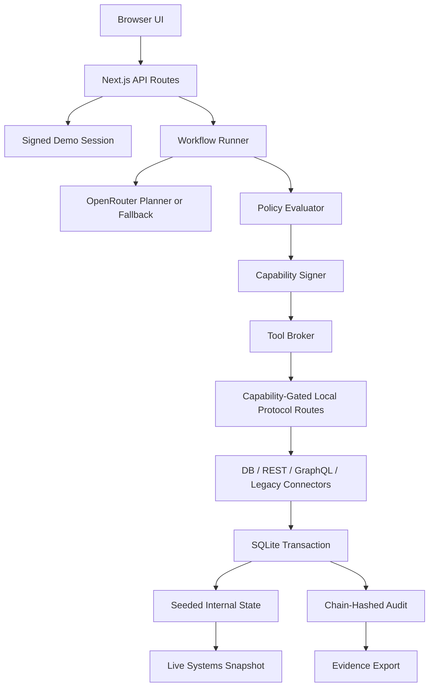

# TDD: AA Firewall

## Architecture

AA Firewall is a Next.js TypeScript modular monolith. The planner can call OpenRouter for structured JSON, but authority stays in deterministic server code: signed session verification, policy evaluation, capability signing, batch approval, connector execution, transaction handling, and audit export.



Runtime choices: SQLite for state and audit, `better-sqlite3` transactions for connector writes, Zod for shared contracts, HMAC for session/capability signatures, OpenRouter chat completions for the live planner, and a deterministic fallback plan for reviewer reliability.

## Core Flow

```text
Prompt -> signed session -> create run -> typed plan
  -> policy-gated reads -> scoped read capabilities -> connector reads
  -> batch approval -> scoped write capabilities -> connector writes
  -> transactional audit/idempotency -> evidence export
```

State machine:

```text
created -> planning -> awaiting_approval -> executing -> completed
              |              |                |
              v              v                v
            blocked        denied          paused
                                             |
                                             v
                                           retrying -> executing
```

## Auth and Security Model

- Start-run is the simulated SSO entry point and mints a signed HTTP-only demo session.
- Protected routes derive actor identity from the server-owned session cookie, not request JSON.
- Roles: `it_admin`, `manager`, `employee`, `security_auditor`.
- Deny by default.
- Model output and connector output are untrusted data.
- Capabilities are HMAC-signed, short-lived, and bound to run, tool, action, resource, actor, scope, and optional approval id.
- Broker rejects malformed, expired, tampered, wrong-tool, wrong-action, wrong-resource, and wrong-scope capabilities and audits `capability_invalid`.

## Connector and Audit Design

The connector layer calls protocol-faithful local stand-ins instead of mutating dashboard-only state:

- `GET /api/internal/db/employee/:id`
- `GET /api/internal/db/access?employeeId=emp_alex`
- `GET /api/internal/rest/tickets?owner=emp_alex`
- `POST /api/internal/rest/tickets/transfer`
- `POST /api/internal/graphql/directory`
- `GET /api/internal/legacy/billing/:employeeId`
- `POST /api/internal/legacy/billing/disable`
- `GET /api/internal/systems/snapshot`
- `POST /api/internal/capability/probe`

Internal endpoints require `Authorization: Bearer <capability-id>`. The server loads the signed capability from SQLite, verifies HMAC/signature/expiry, and checks tool/action/resource/scope against the requested operation. Missing token returns `401`; wrong scope/tool/resource returns `403`.

GraphQL directory uses the `graphql` package with a small real schema. Legacy billing formats and parses a fixed-width record while redacting the billing account code in snapshots and protocol frames.

Each connector operation uses a stable idempotency key. Mutations, idempotency records, connector activity, and `tool_result` audit events are written inside one SQLite transaction. If audit append fails, the connector mutation rolls back. If REST ticketing times out after applying a transfer, the mutation and audit are committed, the run pauses, and retry reuses the existing idempotency key without a duplicate write.

Audit events are hash chained per run. Evidence export includes full audit replay, approval records, policy decisions, capabilities, tool calls, audit root hash, and compact redacted before/after diffs for ticket ownership, access grants, and legacy billing.

SQLite indexes support run-scoped reads for approvals, capabilities, tool calls, connector activity, and audit events.

## Planner

Live planner path:

- Endpoint: `https://openrouter.ai/api/v1/chat/completions`
- Default model: `minimax/minimax-m3`
- Env vars: `OPENROUTER_API_KEY`, optional `OPENROUTER_MODEL`
- Structured output: `response_format: { type: "json_schema", json_schema: ... }`

If the key is missing, the model returns malformed JSON, or schema validation fails, the workflow uses the deterministic fallback plan.

## Critical Tests

| Codepath | Failure mode | Handling | Coverage |
|---|---|---|---|
| Session | missing/tampered/expired | reject protected operation | `tests/session.test.ts` |
| API routes | bad JSON, unknown run, unauthorized actor, invalid approval | structured JSON errors | `tests/api.test.ts` |
| Capability | tool/action/resource/scope mismatch | reject before connector | `tests/security.test.ts` |
| Protocol routes | missing token, wrong scope, valid read/write | 401/403/200 with no authority drift | `tests/internal-systems.test.ts` |
| GraphQL/legacy | invalid query, fixed-width billing state | reject bad query, redact legacy account | `tests/internal-systems.test.ts` |
| Live snapshot | reset/read/approved states | show real backend state and protocol frames | `tests/internal-systems.test.ts`, `e2e/demo.spec.ts` |
| Connector/audit | audit append failure | rollback mutation and idempotency | `tests/workflow.test.ts` |
| Evidence | missing audit replay/diffs | export typed packet | `tests/workflow.test.ts` |
| Approval | duplicate batch submit | no duplicate operations | `tests/workflow.test.ts` |
| Retry | REST timeout after write | recover with idempotency key | `tests/workflow.test.ts`, `e2e/demo.spec.ts` |
| Planner | mocked success, malformed JSON, schema failure, fallback | stable plan source | `tests/planner.test.ts` |
| Demo UI | happy path, blocked role, retry, prompt injection, mobile, nav | reviewer workflow proof | `e2e/demo.spec.ts` |

## Verification

`npm run verify` chains:

```text
npm run lint -> npm test -> npm run build -> npm run test:e2e
```

`lint` currently aliases `typecheck` because `next lint` is no longer available in the installed Next.js version.
