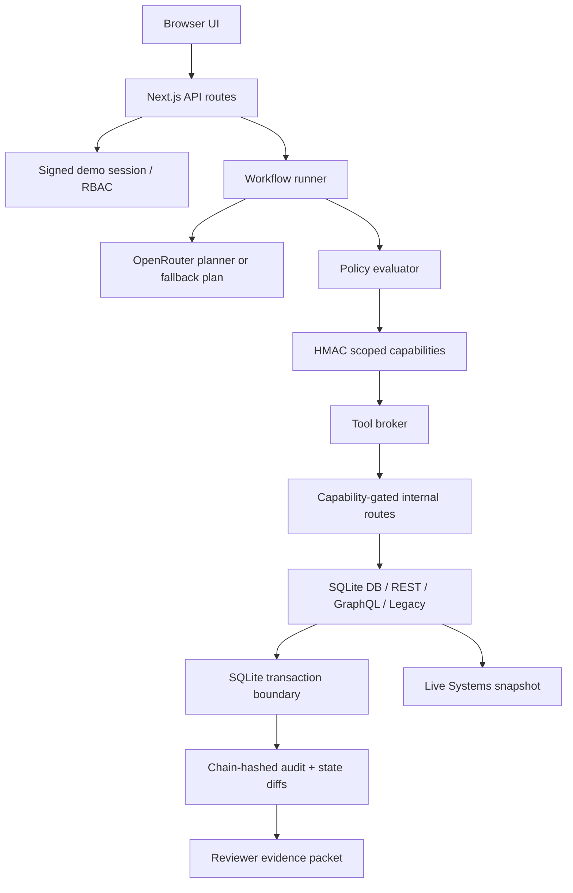

# TDD: AA Firewall

## Architecture Summary

AA Firewall is a Next.js TypeScript prototype for secure agent execution behind a corporate firewall. The UI demonstrates the workflow, but authority is enforced server-side: signed session identity, RBAC, policy evaluation, capability signing, connector execution, approval, idempotency, audit durability, and evidence export all live in deterministic code.

The planner can call OpenRouter for structured JSON using `minimax/minimax-m3`, but model output is only a proposal. If the API key is absent, the response is malformed, or schema validation fails, the workflow uses a deterministic fallback plan so reviewers can always run the prototype.



The local systems are protocol-faithful stand-ins for firewall-constrained enterprise systems. They are intentionally small, but they force the production integration shape: private endpoints, bearer capability IDs, resource-scoped checks, redacted request/response capture, and audit replay.

## Execution and Data Flow

```text
Prompt -> signed session -> typed plan -> policy-gated reads
  -> read capabilities -> connector reads -> batch approval
  -> write capabilities -> connector writes -> audit/evidence export
```

The run state machine is `created -> planning -> awaiting_approval -> executing -> completed`, with `blocked`, `denied`, `paused`, and `retrying` branches. Read steps execute after policy approval. Write steps are collected behind one batch approval gate. After approval, write-scoped capabilities are minted and the broker executes the connector actions.

Core records are stored in SQLite:

- `runs`, `approvals`, `capabilities`, `tool_calls`, `operations`, and `connector_activity` track orchestration.
- `audit_events` stores the hash-chained audit trail.
- `internal_call_frames` stores protocol-level method/path/status/payload evidence.
- Seed tables model the enterprise systems: `employees`, `access_grants`, `tickets`, `directory_edges`, and `legacy_billing`.

The UI reads both the workflow snapshot and the `Live Systems` snapshot. This separation is deliberate: the dashboard does not invent success state. It shows current backend rows plus captured protocol frames.

## Auth and Security Model

The start-run route simulates enterprise SSO by minting a signed HTTP-only demo session for one role: `it_admin`, `manager`, `employee`, or `security_auditor`. Protected workflow routes derive actor identity from that server-owned session cookie, not request JSON. This closes the main demo security gap: a client cannot make itself an admin by posting a different role.

Every connector call requires an HMAC-signed capability. A capability is short-lived and bound to:

- run id and actor id
- tool and action
- resource string, such as `tickets:emp_alex`
- scope, `read` or `write`
- expiry timestamp
- optional approval id for destructive writes

The broker and internal routes verify schema, signature, expiry, tool, action, resource, and scope before execution. Mismatches are rejected and auditable. The `Security Probe` makes the boundary visible: missing token returns `401`, wrong-scope token returns `403`, and valid write capability returns `200`.

Model output, retrieved ticket content, and connector responses are untrusted data. The prompt-injection fixture includes hostile ticket text, but the system treats it as ticket body content and does not mint unrelated CEO capabilities or tool calls.

## Connector Strategy

The prototype covers connector breadth with four protocol styles:

| System | Interface | Demonstrated operation |
|---|---|---|
| Internal DB | SQLite-backed API | Read employee/access; revoke SaaS and database grants |
| REST Ticketing | REST routes | Read open tickets; transfer ownership to Priya |
| GraphQL Directory | `graphql` schema execution | Resolve Alex -> Priya manager relationship |
| Legacy Billing | Fixed-width adapter | Parse and disable a redacted billing record |

Representative internal endpoints:

- `GET /api/internal/db/employee/:id`
- `GET /api/internal/db/access?employeeId=emp_alex`
- `GET /api/internal/rest/tickets?owner=emp_alex`
- `POST /api/internal/rest/tickets/transfer`
- `POST /api/internal/graphql/directory`
- `POST /api/internal/legacy/billing/disable`
- `GET /api/internal/systems/snapshot`
- `POST /api/internal/capability/probe`

Internal routes require `Authorization: Bearer <capability-id>`. The server loads the signed capability from SQLite and validates it against the exact requested operation. The same service layer powers connector execution and direct protocol-route tests, so demo-visible protocol behavior is not a separate mock.

## Audit, Evidence, and Durability

Connector mutation, idempotency record, connector activity, and `tool_result` audit append run inside one SQLite transaction. If audit append fails, mutation and idempotency roll back together. This prevents the dangerous state where a write succeeds but no durable audit exists.

Idempotency keys are stable per run and step. The REST timeout scenario intentionally pauses after a committed ticket transfer; retry reuses the existing idempotency key, records recovery, and avoids duplicate transfer writes.

Audit events are hash-chained per run with sequence numbers and previous-hash linkage. Evidence export includes the prompt, actor, typed plan, approvals, policy decisions, capabilities, tool calls, full audit replay, audit root hash, and redacted before/after diffs for tickets, access grants, and legacy billing. Protocol frames also redact email, ticket body, and billing account code.

SQLite indexes support run-scoped reads for approvals, capabilities, tool calls, connector activity, audit events, and protocol frames.

## Failure Modes and Handling

| Failure mode | Handling |
|---|---|
| Missing/tampered/expired session | Protected workflow route returns structured `401` |
| Unauthorized actor | Run blocks before destructive capabilities mint |
| Capability mismatch | Internal route returns `403`; broker audits invalid capability |
| Bad planner output | Deterministic fallback plan is used |
| Audit append failure | Connector mutation and operation record roll back |
| REST timeout after write | Run pauses; retry recovers with idempotency key |
| Invalid GraphQL query | Directory endpoint returns failure without mutation |
| Prompt-injection ticket text | Treated as data; no authority granted |

## Verification Matrix

| Claim | Verification |
|---|---|
| Session auth is server-owned | `tests/session.test.ts`, route tests for missing/tampered actors |
| API errors are structured | `tests/api.test.ts` |
| Capability mismatch is denied | `tests/security.test.ts`, `tests/internal-systems.test.ts` |
| Internal endpoints are gated | Probe and route tests for `401`, `403`, `200` |
| GraphQL and legacy adapters are real | GraphQL invalid-query test; fixed-width billing snapshot test |
| Audit and mutation are atomic | Rollback test when audit append fails |
| Retry is idempotent | REST timeout E2E and operation-count assertions |
| UI proves real state mutation | Playwright happy path: Live Systems, Security Probe, protocol inspector |
| Planner is reliable for reviewers | OpenRouter mocked success/failure plus deterministic fallback |

`npm run verify` runs typecheck, unit/integration tests, production build, and Playwright E2E.
